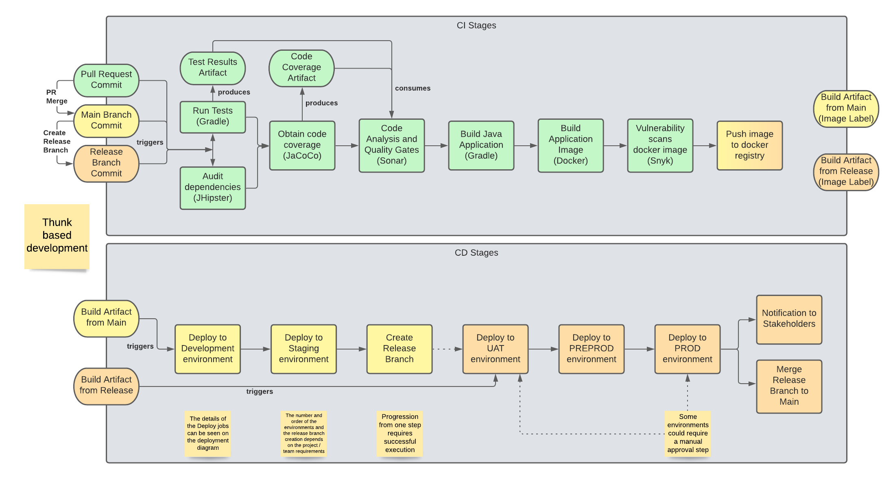
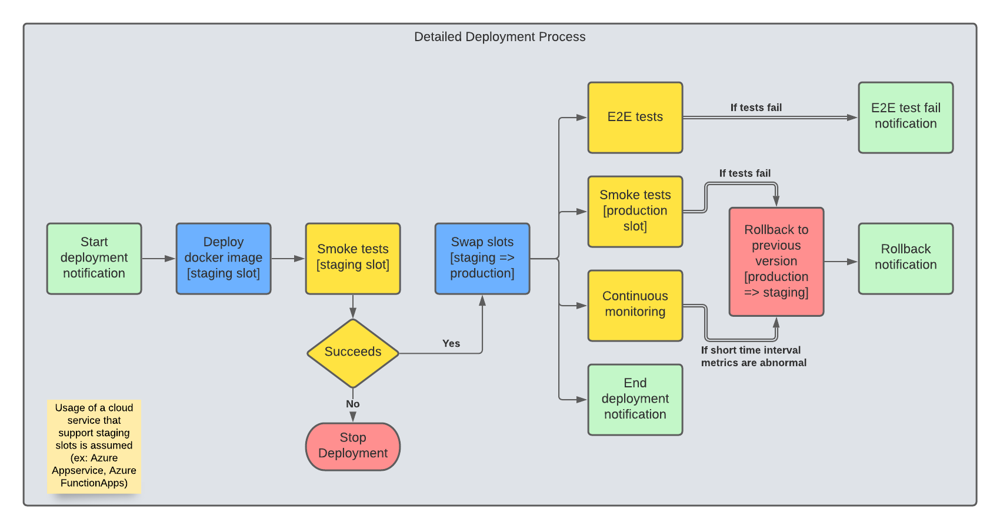
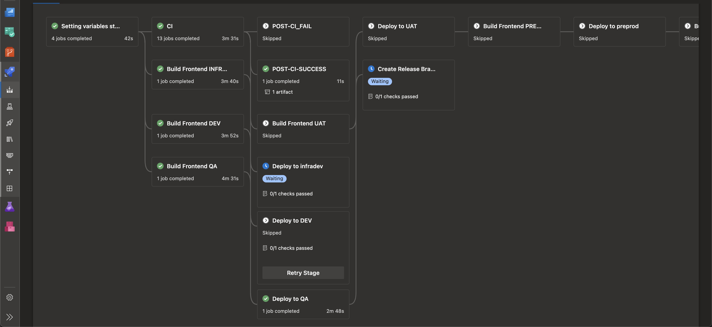
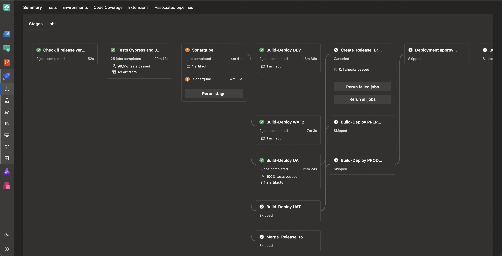
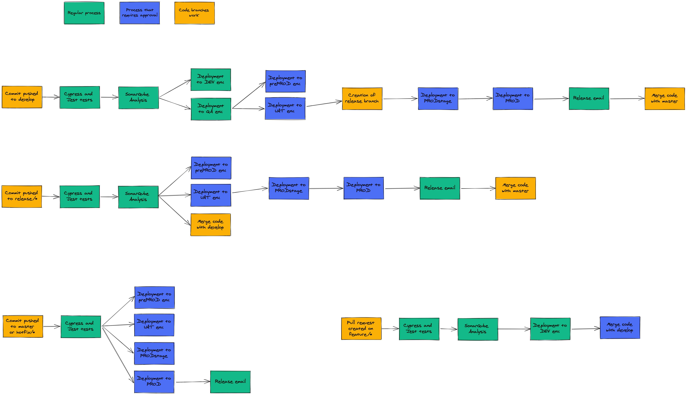
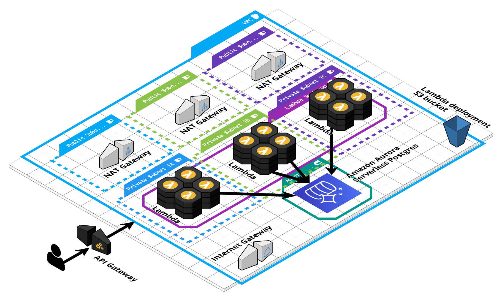
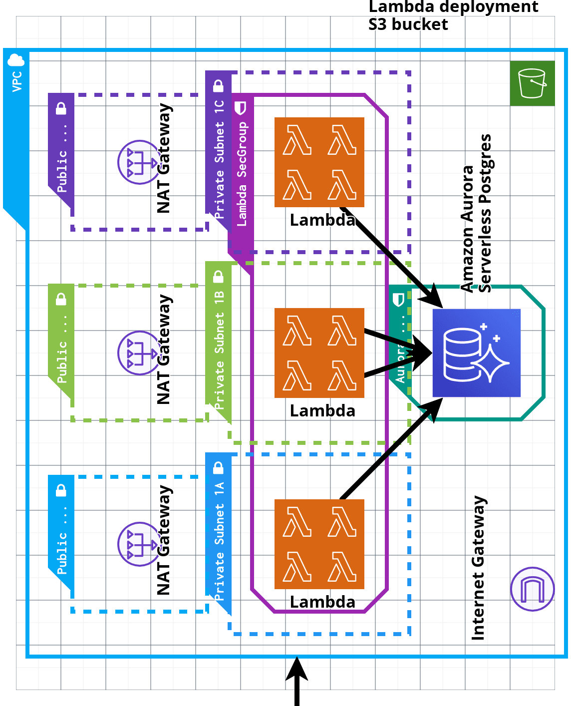

DevOps Engineer Technical Test
==============================

List of exercises
-----------------

## 1. 
**Can you provide any of your code examples? Your public repos like Github, Gitlab, BitBucket, ...?**
 
 

- Data analysis toolkit 
techs: docker, docker-compose, jupyter notebooks, nodejs, reactjs 
https://github.com/darkxeno/data-analysis 

- Local K8S cluster 
techs: terraform, minikube, docker, helm, python 
https://github.com/darkxeno/local-k8s 

- Kubernetes workshop 
https://github.com/darkxeno/kubernetes-workshop 

- Some fixes to use prometheus metrics on AWS cloudwatch 
https://github.com/darkxeno/prometheus-to-cloudwatch/commits/patch-1 

 
 
 

## 2. 
**Describe or draw the pipeline journey of a Java application from development
to publishing it into production. You can draw it on a paper and send a picture,
use a drawing tool like www.draw.io or use any other format you consider
appropriate.**
 
 

Notes: For the overview color are an indication of whether some step are enabled or disabled depending on the commit or artifact source (originating branch)

 
 

Notes: Color are an indication of the types of process performed (notification, deployment, tests, ...)

 
 

Examples about other pipelines done in the past:

Notes: azure devops (partial screenshot) of a kubernetes pipeline 

 
 

Notes: azure devops (partial screenshot) of a web frontend pipeline

 
 

Notes: diagram of the complete CI / CD process for a web (backend + frontend) project

 
 
 

## 3. 
**Explain what is the best way to deploy a change to 50 Linux servers?**
 
 
Depends on the type of change, for example if the change is a configuration change, one of the best approaches would be to include that change on the hardening process where the base VM image is produced and apply the change by rolling upgrades of all the VMs to that new version. 

If there are no VMs, or there are not hardening / configuration change processes in place, or simply because a rolling upgrade is not acceptable because of the scope of the change, fleet configuration tools like ansible should be considered.

If the type of change is part of an application upgrade (deploying a new app version) or so closely related with it, for example a configuration change that requires a new application version because of some compatibility problems, or for cases where we can simply benefit from the deployment tools in place to introduce server configuration changes, for example using helm with daemonsets that are in control of some server parameters or daemonsets that control kernel live patches (https://docs.aws.amazon.com/AWSEC2/latest/UserGuide/al2-live-patching.html). For these cases, and always when release schedules allows for it, using deployment tools, cycles and processes may reduce working flow disruption.

Summarizing, these are some attributes to consider when selecting the best mechanism to deploy changes to many servers:

- Time to resolution, speed or urgency to get the change applied.
- Consistency, will the change be present on any new created servers?
- Error resiliency, will the deployment of the change stop and / or rollback if a failure is detected. Rolling upgrades.
- Disruption of the regular workflow timelines or processes
- Auditability / traceability, how can we better know what changes were applied in the past? how can we better organize our processes to avoid human error?

 
 
 

## 4. 
**Draw a production ready architecture of how you would deploy a Python
application that stores its data in a Postgres database. Please provide all
required elements in the diagram; network, security, system, ... Be creative ;)
You can draw it on a paper and send a picture, use a drawing tool like draw.io
or use any other format you consider appropriate.**

 
 

Assumptions:
The python application doesn't depend on a long-lasting runtime (to be well suited to a Lambda deployment scenario)
The python application is a webservices based application (preferably using HTTPS)

Component list:

- 1 VPC
- 1 Internet Gateway
- 3 NAT Gateways (number can be reduced to afford some costs)
- 3 public subnets for the NAT gateways and connected to Internet (if required) using routes to the Internet Gateway
- 3 private subnets for the Lambda functions, connected to Internet (if required) using routes to the NAT Gateways
- 1 Amazon Aurora Serverless service to provide the Postgres database
- 1 Security group for lambda functions
- 1 Security group for the Aurora Serverless
- 1 Network ACL for the public subnets
- 1 Network ACL for the private subnets
- 1 API Gateway v2
- 1 S3 Bucket for the deployment of the Python functions

Description:

The traffic from the internet flows in using the API Gateway that invokes the Lambda functions distributed across 3 availability zones. The Python lambdas can access the Amazon Aurora connected to the same 3 private subnets (or 3 new additional private subnets if a different Network ACL is necessary). The security groups should allow Http traffic to reach the Lambdas and the Aurora security group should be configured to only allow the Lambdas (by sec. group referencing).

Amazon Aurora Serverless should be a very affordable and scalable way to provide a DB service to Lambda functions, if the computing demand or any other reasons doesn't make Aurora Serverless applicable for our application, usage of a regular Amazon Aurora Postgress cluster or Amazon RDS for Postgress can be considered.

To obtain the best benefits from this architecture the Python application should be modularized or decomposed in microservices.

Autogenerated terraform (from diagram) can be found here: 
[Sample Terraform](exercises/4-production-architecture/) 
Note: non-working, non-final terraform files, only illustrative of the possibilities of the diagram tool. 

 
 
 

## 5. 
**Provide example names of commercial services for IaaS, PaaS and SaaS.**

*IaaS*: AWS ec2, Azure virtual machines, Azure virtual machine scale sets, ... 
*PaaS*: Azure function apps, Azure app services, AWS lambdas, AWS beanstalk, ... 
*SaaS*: Atlassian Cloud, Confluent Cloud, Elasticsearch Service, ... 

 
 
 

## 6. 
**Provide a Dockerfile that installs a Nginx and static code (HTML, CSS &
Javascript) into a Linux image. Provide resolved script. Start Dockerfile with
"FROM ubuntu:latest" or "FROM centos:latest".**

Solution can be found here:

[Dockerfile](exercises/6-dockerfile/Dockerfile)

Uses a docker multi-stage to build the static assets and copy them over to the Ubuntu based image.
 
 
 

## 7. 
**Create a basic Kubernetes configmap, in Helm format, template and values to
provide file config.xml in a cluster namespace. Provide the needed lines to add
in a deployment template too. Provide resolved scripts.**

[Solution](exercises/7-helm/)

A test script can be found here:

[Bash Script](exercises/7-helm/test.sh)

 
 
 

## 8. 
**Check this script: https://tinyurl.com/yywugvcb
Are there any errors? If so, can you fix them? Provide resolved script.**

[Solution](exercises/8-kubernetes/challenge.yaml)

A test script can be found here:

[Bash Script](exercises/8-kubernetes/test.sh)

 
 
 

## 9. 
**Provide a Terraform template that provisions an Azure Postgres database and
an Azure Virtual Machine in a private network. Provide resolved script.**

[Solution](exercises/9-terraform/terraform)

Unfortunately, this solution has not been tested thoughtfully, because of the lack of an Azure user with 'Microsoft.Network/virtualNetworks/write' permissions.

 
 
 